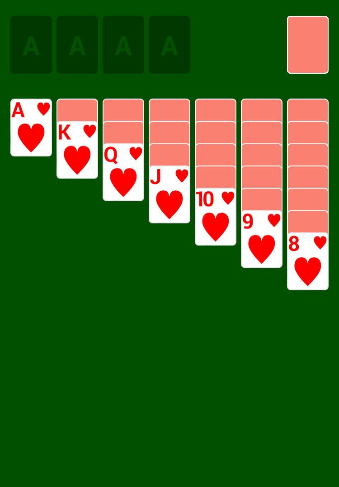

# Klondike

Build up four stacks of cards by suit from Ace to King.  
You can [play Klondike online](https://alex-berson.github.io/klondike/) or  

You can also [watch an AI playing Klondike](https://alex-berson.github.io/klondike/?mode=ai).

## Description

**Klondike** is a single-player card game, and the best known and most popular version of the patience or solitaire family. It is played using a standard 52-card deck, without Jokers.

The game starts with seven piles of cards laid out in a row. Each pile has one more card than the one before it, starting with one card in the first pile and ending with seven cards in the last pile. The top card of each pile is face up.

The remaining cards form the stock and are placed face down at the upper right of the layout.

The four foundations are built up by suit from Ace to King in ascending order. The tableau piles can be built down in descending order by alternate colors. For example, a red Queen can be placed on a black King. Any face-up card, or sequence of cards, in a tableau pile can be moved to another tableau pile based on its highest card. Empty piles can be filled with a King or a sequence of cards starting with a King.

When no further moves are possible in the tableau, the top card from the stock is dealt face up to a waste pile. The top card of the waste pile is always available for play to either the foundations or tableau.

The aim of the game is to build up the four foundation stacks each starting with an Ace and ending with a King, all in the same suit. If no more meaningful moves are possible and winning is unachievable, the game is lost.

## Screenshot

  

## License

Copyright &copy; 2023 Alexander Berson. This project is licensed under the [MIT license](LICENSE.txt "MIT License").

